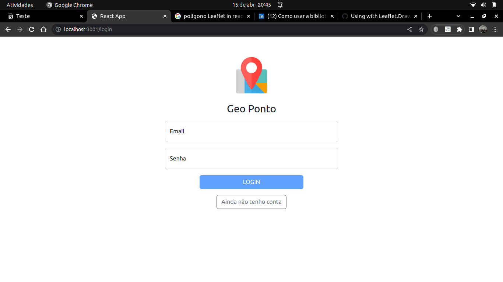
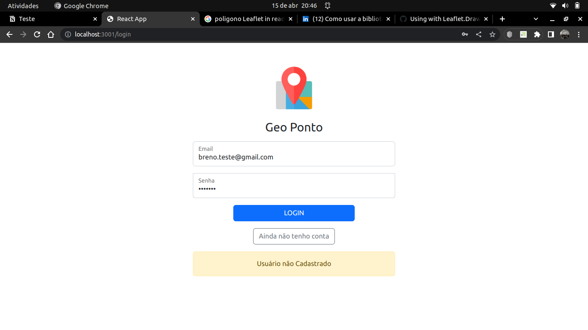
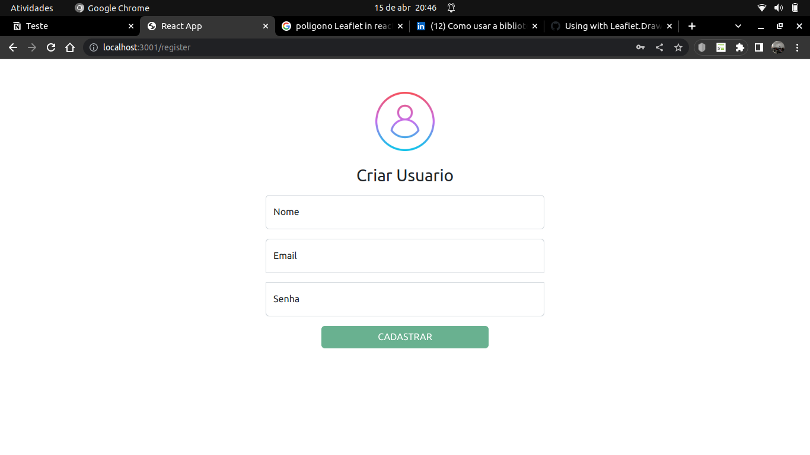
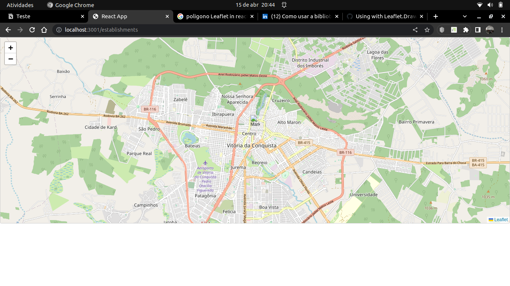

# Projeto Geo Ponto!

<details>
<summary><strong>👨‍💻 Telas</strong></summary><br />

  **Tela Login**
  

  **Tela Login - Usuario Não Cadastrado**
  

  **Criar Usuario**
  

  **Mapa**
  


</details>

<details>
<summary><strong> Estrutura do projeto </strong></summary><br />

<strong>O projeto é composto de 3 entidades importantes para sua estrutura</strong>


1️⃣ **Banco de dados:**
  - Tem o papel de fornecer dados para o serviço de _backend_.

2️⃣ **Back-end:**
 - Deve rodar na porta `3000`, pois o front-end vai fazer as requisições para ele nessa porta;

3️⃣ **Front-end:**
  - O front se comunica com serviço de back-end pela url `http://localhost:3001` através dos endpoints construidos.

</details>

# Orientações

<details>
<summary><strong> 🔰 Iniciando o projeto</strong></summary><br />

  1. Clone o repositório `Usar link SSH`

- Entre na pasta do repositório que você acabou de clonar:
  * `cd project-geo-point`
  * --> `cd app/backend` para acessar o Back-End
  * --> `cd app/frontend/` para acessar o Front-End

  2. Instale as dependências, em ambos os diretorios
  * `npm install`


</details>

<details>
<summary><strong> ⚠️ Configurações mínimas para execução do projeto</strong></summary><br />

Na sua máquina você deve ter:

 - Sistema Operacional Distribuição Unix
 - Node versão 16

➡️ O `node` deve ter versão igual ou superior à `16.14.0 LTS`:
  - Para instalar o nvm, [acesse esse link](https://github.com/nvm-sh/nvm#installing-and-updating);
  - Rode os comandos abaixo para instalar a versão correta de `node` e usá-la:
    - `nvm install 16.14 --lts`
    - `nvm use 16.14`
    - `nvm alias default 16.14`

</details>


# Desenvolvimento

<details id='Variaveis-de-ambiente'>
<summary><strong> ⚙️ Variáveis de ambiente </strong></summary><br />

  **No diretório `/` renomeie o arquivo `.env.example` para `.env` e configure os valores de acordo com o cenário do seu ambiente (credenciais de banco de dados, secrets desejadas e etc)**. Isso vai permitir que você inicialize a aplicação fora do _container_ e ela se conecte com seu banco local caso deseje.
 > `./env.example`
  ```txt
  MYSQL_USER=root
  MYSQL_PASSWORD=sua_senha
  MYSQL_DATABASE=geo_point_db
  MYSQL_HOST="127.0.0.1"
  MYSQL_DIALECT=mysql
  MYSQL_PORT=3306
  HOSTNAME=localhost
  PORT=3001
  API_PORT=3000
  ```

</details>

<details id='sequelize'>
  <summary><strong>🎲 Sequelize</strong></summary>
  <br/>

  ⚠️ O `package.json` do diretório `/` contém um script `db:reset` que é responsável por "dropar" o banco, recriar e executar as _migrations_ e _seeders_. Você pode executá-lo com o commando `npm run db:reset` se por algum motivo precisar recriar a base de dados;

  ⚠️ **O sequelize já foi inicializado, portanto NÃO é necessário executar o `sequelize init` novamente**

</details>
